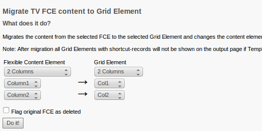
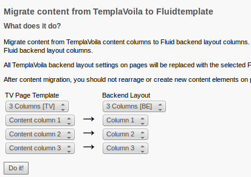
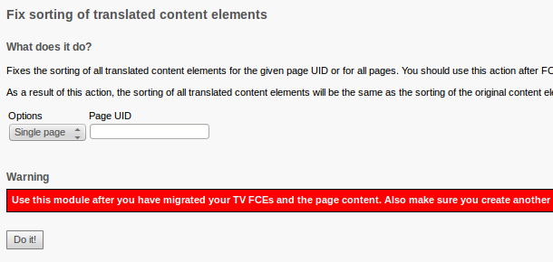

TemplaVoila migration to Fluidtemplate and Grid Element
=======================================================

## What is it?

A TYPO3 Extension with tools that can be helpful when migrating an existing TYPO3 website
made with TemplaVoila to Fluidtemplate and Grid Elements

## Included modules

* Module to mark all unreferenced elements as deleted
* Module to convert references to "insert records" elements
* Module to migrate the content of a flexible content element to a Grid Element
* Module to migrate content from TemplaVoila columns to Fluidtemplate columns
* Module to convert GridElements where the language is set to "all languages"
* Module to fix the sorting of translated content elements

## Who should use it?

This extension should be used by TYPO3 integrators with good knowledge of TemplaVoila, Fluidtemplates, Grid Elements
and TypoScript.

## Prerequisites

* A full backup of your TYPO3 website (database and files)!
* TemplaVoila version 1.8 installed and with old page module enabled
* ExtBase and Fluid installed
* Grid Elements installed (please ignore conflict with TemplaVoila!)

## Extension settings

The following settings are available in the extension settings.

**rootPid**

If this field is set to a valid PID from the page tree, only this page and all subpages will be included during all
migration steps.

Default value: empty

**includeNonRootPages**

Only respected, when ```rootPid``` is empty. If set, also non root pages are selected from the pagetree
when the extension selects TYPO3 pages to be included in the migration.
 
Default value: off

**pagesDepthLimit**

The page depth limit for fetching subpages from the pagetree when the extension selects TYPO3 pages to
be included in the migration process.

Default value: 99

## Migration steps in short

1. Create Grid Elements for all Flexible Content Elements you wish to migrate
2. Create backend layouts and Fluidtemplates for all TemplaVoila page templates you wish to migrate
3. Delete all unreferenced elements
4. Convert references to "insert records" elements
5. Delete all unreferenced elements (conversion of references to FCE elements to insert records creates new unreferenced elements)
6. Migrate all Flexible Content Elements to Grid Elements
7. Migrate all TemplaVoila page templates to Fluidtemplate
8. Delete TemplaVoila-Folder General Record Storage Page from root page
9. Remove TemplaVoila
10. Optionally convert GridElements with "all languages"
11. Optionally fix the sorting of translated content elements

## Delete unreferenced elements

Many users working with TemplaVoila think, that the "unlink" function for content elements deletes the desired
content elements. Actually, the content element only gets unlinked from the TemplaVoila layout and persists
on the page. On the TemplaVoila tab "Non-used elements" all content elements are shown which that are not linked
on the actual page.

When migrating a TYPO3 website from TemplaVoila to Fluidtemplate, all unreferenced elements should be deleted,
since they are not shown on the output page. You can use this module to perform this action.

The action can safely be used, since it only flags all unreferenced elements as deleted.

## Convert references to "insert records" elements

This module searches recursive on all pages for TemplaVoila reference elements and converts them to "insert records"
elements.

This module replaces the setting "Create shortcut element for TV references" which was an optional setting in
tv2fluidge < version 0.4.x.

You should use this module before you start with migration of Flexible Content Elements and page content.

## Migrate FCE



This module migrates content from a Flexible Content Element to an existing Grid Element. If the Flexible
Content Element contains content columns, they can be remapped to content columns of the target Grid Element.

### Prerequisites

Before you can start with the migration, you must create a Grid Element for each Flexible Content Element you wish
to migrate. If your Flexible Content Element contains JavaScript, you should include this somewhere in you page
TypoScript or Grid Element TypoScript.

**Flexible Content Elements with content columns only**

If your Flexible Content Element only constists of content columns (e.g. 2 column FCE), you should
create a new Grid Element with number of content columns from your Flexible Content Element

**Flexible Content Elements with flexform only**

If your Flexible Content Element only constists of flexform fields (input, images, TypoScript, ...), you should
create a new Grid Element and insert the flexform XML from the Flexible Content Element in the Grid Element.

When creating the TypoScript for the new Grid Element, you can use `field:flexform_` to get the flexform values.

Example:

```
20 = TEXT
20.data = field:flexform_myfieldname
```

**Flexible Content Elements with mixed flexform and content columns**

If your Flexible Content Element contains a mix of content columns and flexform, you should create a new Grid
Element and and insert the flexform XML from the Flexible Content Element in the Grid Element.

Then setup the Grid Element like shown in the below.

Example:

```
1 <  lib.gridelements.defaultGridSetup
1 {
    columns {
      # colPos ID
      0 < .default
      0.wrap = <div class="content">|</div>
    }
    wrap.stdWrap.cObject = COA
    wrap.stdWrap.cObject {
      10 = TEXT
      10.data = field:flexform_myfieldname
    }
  }
```

### Migrating a Flexible Content Element

To migrate a Flexible Content Element, just select it from the "Flexible Content Element" select box in the module.
Next you must select a target Grid Element in the "Grid Element" select box.

If your Flexible Content Element contains content columns, then you can remap them to content columns in the target
Grid Element.

### How does the migration work?

The FCE migration module finds all Flexible Content Elements of the selected type, changes the content type
to GridElement and sets the selected backend layout for the Grid Element. Then it copies the content from
`tx_templavoila_flex` to `pi_flexform`. If the selected Flexible Content Element has content columns, then all
content elements will be mapped to the selected content columns of the target Grid Element.

## Migrate content



This module migrates content from TemplaVoila content columns to backend layout content columns based on
Fluidtemplate. After the content migration, the selected backend layout gets assigned to the "Backend Layout"
select boxes.

It also migrates flexform fields (e.g. textfields or images, which are used in your frontend output).
The flexform fields will be migrated to the Database fields, if those fields exist.
If the corresponding field does not exist, they will be ignored.

### Prerequisites

Before you can start with the migration, you must create a backend layout and Fluidtemplate for each TemplaVoila
page template you wish to migrate.

For TemplaVoila templates with only content columns, you should just create backend layouts and Fluidtemplates
with the same amount of content columns. Be sure to set a decent name to each content column, so you later can
identify them when remapping from TemplaVoila content columns to backend layout content columns.

It is important to check, that both dropdown boxes for the TemplaVoila Template Design contains a template.
So make sure "Use Template Design" and "Subpages - Use Template Design" contains a valid template.

If your TemplaVoila template contains FlexForm fields (e.g. input, images, ...) and you want to keep them
then you should create database fields for them (in table "pages" and "pages_language_overlay").
Those fields need to be named as the fields in the FlexForm but can contain a prefix (which can be specified per template).

### Migrating content from TemplaVoila

To migrate content from TemplaVoila, just select the TemplaVoila Page Template the "TV Page Template" select box
in the module. Next you must select a target backend layout in the "Backend Layout" select box. Finally remap all
content columns from the TemplaVoila Page Template to the target content columns of the backend layout.

After content migration, you should not rearrage or create new content elements on pages with a Fluid Template, when
TemplaVoila is still installed. TemplaVoila uses a method named correctSortingAndColposFieldsForPage, which may move
all content elements to column 0.

### How does the migration work?

The content migration module finds all pages with the selected TemplaVoila Page Template and remaps all content
elements to the selected target content columns of the backend layout. After the content migration, the selected
backend layout gets assigned to the "Backend Layout" select boxes.

### Post-process steps

After the content migration, you should check in the TYPO3 backend, that content elements in the page module have
the correct ordering. If this is not the case, you have to manually reorder all translated content elements.

## Convert GridElements with language set to "all languages"

On multilingual sites made with TemplaVoila you can set the language FCEs to "all languages" and translate multilingual
content directly inside the FCE container. Using backend layouts and GridElements this can cause some problems after
migrating of a TemplaVoila site with this extension and I would recommend to use a translated Grid Element for each
page language.

This converter clones Grid Elements with "all languages" so you have individually translated Grid Elements for each
page translation. The conversion process also reassigns all child content elements of the original Grid element to the
now translated Grid Element.

### Prerequisites

This module should only be used when the following steps are processed:

* Migration of TemplaVoila Flexible Content Elements to GridElements
* Migration of content from TemplaVoila to Fluid Template
* It is recommended to create a backup of your TYPO3 database, so you can easily roll back if the conversion fails

### Post-process steps

Atfer the conversion, you should use the module "Fix sorting" to apply the sorting of the original content elements
to the translated content elements.

If the original Flexible Content Elements used flexform fields (e.g. textfields or imagefields), the migration
will also modified the FlexForm to use lDEF and vDEF only, so one has to set
`<langDisable>1</langDisable>` to the flexform of your GridElement

Also check, if you have content, which does not have a default language. In this case, your TypoScript Setup
should **not** contain `sys_language_overlay = hideNonTranslated`
Or in TYPO3 v6.2 one can keep this setting but also
needs to use the new TypoScript option: `select.includeRecordsWithoutDefaultTranslation`,
see http://docs.typo3.org/typo3cms/TyposcriptReference/Functions/Select/Index.html

If css_styled_content is used this option could be used the following way:
```
styles.content.get.select.includeRecordsWithoutDefaultTranslation = 1
styles.content.getLeft.select.includeRecordsWithoutDefaultTranslation = 1
styles.content.getRight.select.includeRecordsWithoutDefaultTranslation = 1
styles.content.getBorder.select.includeRecordsWithoutDefaultTranslation = 1
```

## Fix sorting of translated content elements



This module sets the sorting to all translated content elements, so it will be the same as for the original content
element.

### Prerequisites

This module should only be used when the following steps are processed:

* Migration of TemplaVoila Flexible Content Elements to GridElements
* Migration of content from TemplaVoila to Fluid Template
* Conversion of Grid Elements with language set to "all languages"
* It is recommended to create a backup of your TYPO3 database, so you can easily roll back if the result is not as expected

## Feedback and updates

The extension is hosted on GitHub. Please report feedback, bugs and changerequests directly at
https://github.com/derhansen/sf_tv2fluidge
